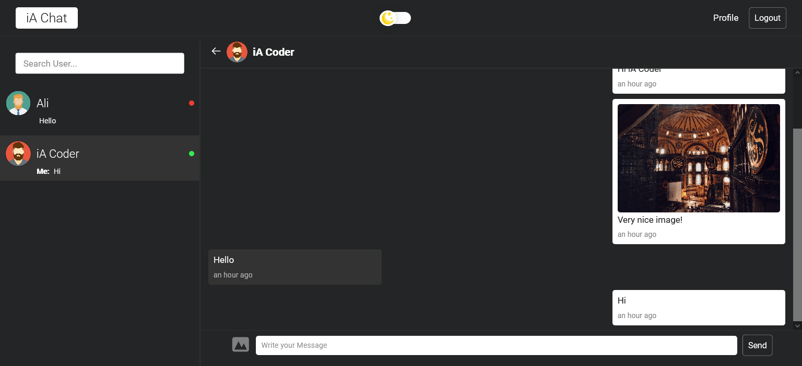

# Modern iA Chat App

iA Chat App is a Messaging sender app to conversation with other users.

## Authors

- [@mhistiak3](https://github.com/mhistiak3)

## Screenshots



## Technology

**Client:** React, Custom Css, Firebase Auth, Firebase Firestore, Firebase Srorage, React Router, monent

## Run Locally

Clone the project

```bash
  gh clone https://github.com/mhistiak3/react-ia-chat-app.git
```

Go to the project directory

```bash
  cd chat-app
```

Install dependencies

```bash
  npm install
```

Start the server

```bash
  npm start
```


